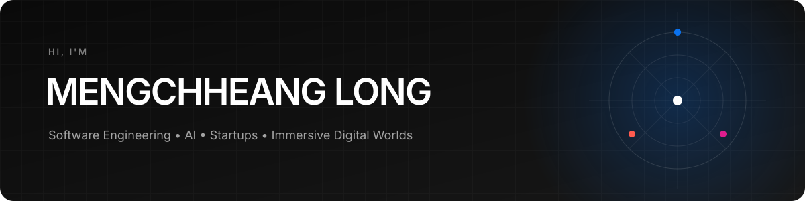
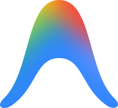
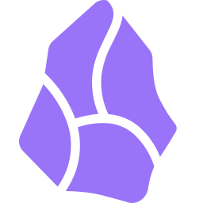

  

  I'm passionate about exploring how intelligent systems can shape the future of software, games, and immersive digital experiences.

  <code>Software Engineering</code>&nbsp;&nbsp;
  <code>AI</code>&nbsp;&nbsp;
  <code>Startups</code>&nbsp;&nbsp;
  <code>Immersive Digital Worlds</code>

 

## About

I'm interested in **AI agents, generative games, world simulation, and immersive digital worlds**. These are long-term interests that I explore through continuous learning, experimentation, and building projects.

My approach is simple: understand the fundamentals, experiment with new ideas, and keep building toward increasingly ambitious systems.

## Current Focus

- **AI Agents** — Exploring how intelligent agents can reason, use tools, collaborate, and automate complex workflows.
- **Generative Games & World Simulation** — Learning how AI can generate interactive worlds, simulations, and dynamic gameplay experiences.
- **Startups & Product Building** — Studying how emerging technologies become practical products and sustainable businesses.

## Daily stack

  &nbsp;&nbsp;&nbsp;&nbsp;&nbsp;
  

## Tools I've explored

  &nbsp;&nbsp;&nbsp;
  &nbsp;&nbsp;&nbsp;
  &nbsp;&nbsp;&nbsp;
  &nbsp;&nbsp;&nbsp;
  &nbsp;&nbsp;&nbsp;
  &nbsp;&nbsp;&nbsp;
  &nbsp;&nbsp;&nbsp;
  

  Each logo links to its official project or source. Asset provenance is documented in <a href="assets/tools/SOURCES.md">SOURCES.md</a>.

 

---

  <strong>Always learning. Always building. Always exploring what's next.</strong>

