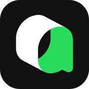

# Hello, I'm Mengchheang Long 👋

Software Engineering student building at the intersection of **AI, startups, and immersive technology**.

I'm exploring **AI agents, generative games, world simulation, and immersive digital worlds**—long-term interests I pursue by learning, experimenting, and turning ideas into real projects.

## 🛠️ Daily Tools

  &nbsp;&nbsp;&nbsp;
  

## 🔍 Previously Explored

  &nbsp;&nbsp;
  &nbsp;&nbsp;
  &nbsp;&nbsp;
  &nbsp;&nbsp;
  &nbsp;&nbsp;
  &nbsp;&nbsp;
  &nbsp;&nbsp;
  &nbsp;&nbsp;
  &nbsp;&nbsp;
  

Each logo links to the tool's official project page or source repository. Logo provenance is documented in [`assets/tools/SOURCES.md`](assets/tools/SOURCES.md).

...and many other AI development tools.

---

> **Always learning. Always building. Always exploring what's next.**
