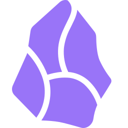

  

  <strong>Backend Engineer</strong> specializing in resilient distributed systems, transactional architectures, and multi-tenant platforms.

  <a href="https://github.com/coorad-company"><code>🏢 Coorad</code></a>&nbsp;&nbsp;
  <a href="https://github.com/coorad-company"><code>🚀 Angkoro</code></a>&nbsp;&nbsp;
  <a href="https://github.com/OpenFullDive"><code>🌐 OpenFullDive</code></a>&nbsp;&nbsp;
  <a href="#-tech-stack"><code>🛠️ Tech Stack</code></a>

 

## About Me

I am a **Backend Engineer** focused on building high-reliability distributed systems, multi-tenant architectures, and transactional services. My engineering work centers on **immutable financial ledgers**, **event-driven outbox pipelines**, **asynchronous task scheduling**, and **payment gateways**.

From designing double-entry bookkeeping engines with zero-leak financial integrity to orchestrating distributed job workers with BullMQ and Redis, I emphasize correctness, strict data isolation, and production-grade resilience.

---

## 🏢 Startups & Projects

### [Coorad](https://github.com/coorad-company) — Company Startup
**Coorad** is a technology startup focused on building scalable software infrastructure, digital platforms, and production-grade software products.
- **GitHub:** [github.com/coorad-company](https://github.com/coorad-company)
- Serves as the parent organization driving product engineering and platform initiatives.

### [Angkoro](https://github.com/coorad-company) — Flagship Multi-Tenant Commerce Platform
**Angkoro** is the core commercial product engineered and released by Coorad. It is a multi-tenant commerce and billing platform API engineered for mission-critical reliability, performance, and transactional consistency.
- **Key Engineering Highlights:**
  - **Immutable Double-Entry Financial Ledger:** Implemented full double-entry journaling (`ledger_transactions` / `ledger_entries`) with per-store escrow and wallet balance projections. Financial integrity is reinforced via database row-level locking (`FOR UPDATE SKIP LOCKED`) and `ON DELETE RESTRICT` constraints.
  - **Transactional Outbox Pattern:** Closes post-commit event gaps by writing financial side effects (refunds, order updates) directly into transactional outbox records within the same DB transaction, relayed at-least-once with idempotent worker consumers.
  - **Partitioned Dual-Redis Infrastructure:** Separates application caching (`cache`) from operational control (`control`), handling distributed leader leasing, IP lockouts, cluster-wide rate limiting, and BullMQ queues.
  - **Deadline Scheduling & Reconciliation:** Delayed BullMQ jobs enforce exact-time lifecycle milestones (escrow release, payment expirations, order SLAs), coupled with idempotent cron sweeps as self-healing backstops.
  - **Secure Payment Rails:** Integrated **ABA PayWay** and **Bakong KHQR** payment processing, secured with AES-256-GCM data encryption at rest for sensitive credentials.

### [OpenFullDive](https://github.com/OpenFullDive) — Personal R&D Initiative
A personal exploratory research and development project focused on immersive technologies and digital systems (currently unreleased and in private development).
- **GitHub:** [github.com/OpenFullDive](https://github.com/OpenFullDive)

---

## 🎯 Backend Engineering Specialization

- **Financial Integrity & Double-Entry Ledgers:** Immutable accounting records, escrow state machines, wallet projections, and strict balance validation.
- **Transactional Outbox & Event Reliability:** Eliminating dual-write inconsistency hazards between relational databases and asynchronous message brokers.
- **Distributed Queues & Concurrency:** BullMQ worker orchestration, deadline-driven scheduling, cluster-wide rate limiting, and Redis distributed leader leases.
- **Multi-Tenant SaaS Architecture:** Tenant-isolated data models, attribute/role-based access control (ABAC/RBAC), and subscription-tier feature gating.
- **Payments & Cryptography:** End-to-end payment gateway lifecycle handling (ABA PayWay, Bakong KHQR), webhook cryptographic signature verification, and AES-256-GCM at-rest encryption.

---

## 🛠️ Tech Stack

### Backend & Core

  
  
  
  
  

### Databases & ORMs

  
  
  
  
  

### Distributed Systems & Infrastructure

  
  
  
  
  
  
  

### Payments, Security & Reliability

  
  
  
  
  
  
  

### Frontend Familiarity (Full-Stack Competency)

  
  
  
  

---

## 🤖 AI & Engineering Workflows

  &nbsp;&nbsp;&nbsp;&nbsp;
  &nbsp;&nbsp;&nbsp;&nbsp;
  &nbsp;&nbsp;&nbsp;&nbsp;
  &nbsp;&nbsp;&nbsp;&nbsp;
  

  &nbsp;&nbsp;&nbsp;
  &nbsp;&nbsp;&nbsp;
  &nbsp;&nbsp;&nbsp;
  &nbsp;&nbsp;&nbsp;
  

  Tooling asset provenance documented in <a href="assets/tools/SOURCES.md">SOURCES.md</a>.

 

---

  <strong>Building resilient systems. Architecting scalable backends. Always shipping.</strong>

