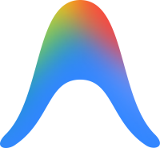

  

  <strong>Backend Engineer</strong> specializing in distributed architectures, scalable microservices, and polyglot datastores.

  <code>Backend Engineering</code>&nbsp;&nbsp;
  <code>Distributed Systems</code>&nbsp;&nbsp;
  <code>AI Systems</code>&nbsp;&nbsp;
  <code>Startups</code>

 

## Backend

I specialize in **Backend Systems, Microservices, and Distributed Architectures**. My engineering focus is centered on designing resilient backends that handle high-concurrency workloads, polyglot data persistence, real-time communications, and secure system integrations.

- **Distributed Systems & Polyglot Architectures:** Architecting scalable NestJS microservices backed by specialized datastores — relational (PostgreSQL), document (MongoDB), high-throughput telemetry (Apache Cassandra), graph traversal (Neo4j), and analytical warehouses (Apache Hive).
- **Domain-Driven Design (DDD) & CQRS:** Building clean enterprise backends using Command Query Responsibility Segregation (CQRS) and domain event-driven patterns.
- **Message Queuing & Concurrency:** Designing asynchronous pipelines, worker pools, and broker integrations using Redis, RabbitMQ (`amqplib`), and BullMQ.
- **Real-Time Communications & Chat:** Implementing event-driven real-time chat, state synchronization, and low-latency bidirectional messaging with WebSockets (`socket.io`).
- **Data Integrity & Security:** Enforcing strict schema validation (Zod, Class-Validator), structured logging (Pino, Winston), robust authentication (Argon2, JWT, Supabase), and end-to-end API documentation (OpenAPI / Swagger).

---

## Tech Stack

### Languages & Runtimes

  
  
  
  
  

### Backend Frameworks & Architecture

  
  
  
  

### Databases & Polyglot Persistence

  
  
  
  
  
  

### ORMs & Data Access

  
  
  

### Messaging, Queues & Infrastructure

  
  
  
  
  

---

## AI

I engineer and integrate AI capabilities into production applications and agentic workflows:

- **AI-Integrated Applications:**
  - **[CollabAI Backend](https://github.com/mengchheanglong/collabai-backend)** — Real-time AI collaboration backend built with NestJS, CQRS, WebSockets, and OpenAI integration.
  - **[AI-Workspace Backend](https://github.com/mengchheanglong/AI-Workspace-backend)** — Project workspace API integrating the Model Context Protocol (MCP) server standard and LLM tooling.
  - **[Evalora Backend](https://github.com/mengchheanglong/evalora-backend)** — Assessment platform backend integrating automated AI template generation and dynamic AI interview workflows.
- **Applied NLP & Agent Research:**
  - **[Khmer Legal Retrieval](https://github.com/mengchheanglong/khmer-legal-retrieval)** — Evaluated deep learning retrievers (XLM-R, BiLSTM, PrahokBART) for citation-grounded Khmer legal RAG.
  - **[Agent Workflow](https://github.com/mengchheanglong/agent-workflow)** — Framework for orchestrating deterministic, controlled AI agent task execution.

  &nbsp;&nbsp;&nbsp;&nbsp;
  &nbsp;&nbsp;&nbsp;&nbsp;
  &nbsp;&nbsp;&nbsp;&nbsp;
  &nbsp;&nbsp;&nbsp;&nbsp;
  

  Asset provenance documented in <a href="assets/tools/SOURCES.md">SOURCES.md</a>.

---

## Startups

- **[Rentify](https://github.com/Thna17/Rentify)** `(CEO)` — SaaS commerce and business platform for Cambodian SMEs, providing merchant management, customizable storefronts, POS, and KHQR-ready checkout.
- **[Coorad](https://github.com/coorad-company)** `(Developer)` — Technology startup building digital platforms; engineered the internal **Angkoro Admin** portal for operations, merchant governance, and administrative oversight.
- **[OpenFullDive](https://github.com/OpenFullDive)** `(Solo R&D)` — Personal research and development project exploring immersive digital worlds and interactive systems (unlaunched).

 

---

  <strong>Building resilient systems. Architecting scalable backends. Always shipping.</strong>

